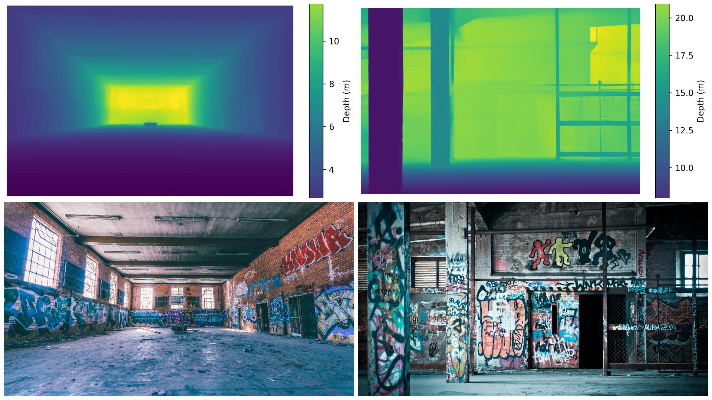

# 3d-Reconstruction Toolkit for high fidelity Sim environment

This project uses a monocular depth model in a modular Python toolkit. It can run inference on single images or batches, and export aligned RGB-D assets including:

- Metric depth maps (`*.png` and `*.npy`)
- Dense RGB point clouds (`*.ply` in ASCII format)

<p align="center">
  
</p>

All outputs are generated per input image and stored under an output directory you choose.

## Requirements

- Python 3.11 (In accordance with other SDKs)
- Sufficient disk space for the model checkpoint (~1.9 GB)
- Additional space for the SAM checkpoint (~375 MB for the ViT-B variant) (Under Development)
- CPU-only inference is supported, but a CUDA-enabled GPU significantly speeds things up (optional).

Install the dependencies into a virtual environment:

```bash
# Traditional venv based environment management

python -m venv .venv
source .venv/bin/activate
pip install --upgrade pip
pip install -r requirements.txt

# Or use uv package manager

uv sync
```

## Running inference

### Single image

```bash
source .venv/bin/activate
python scripts/run_depth.py \
  --image sample_data/test_image.png \
  --output-dir outputs

# When using UV
uv run scripts/run_depth.py \
  --image sample_data/test_image.png \
  --output-dir outputs

```

### Batch mode

```bash
source .venv/bin/activate
python scripts/run_depth.py \
  --input-dir path/to/images \
  --batch-size 2 \
  --device cuda:0 \
  --output-dir outputs
```

CLI options:

| Flag | Description |
| --- | --- |
| `-i, --image` | Individual image path (can be repeated) |
| `-d, --input-dir` | Folder to scan recursively for supported image files |
| `-o, --output-dir` | Destination folder for depth maps and point clouds |
| `--cache-dir` | Directory used to cache the downloaded checkpoint (`models/depth_pro` by default) |
| `--device` | Torch device spec (`cpu`, `cuda`, `cuda:0`, …). Defaults to auto-detect. |
| `--precision` | `float32` (default) or `float16` (requires CUDA) |
| `--batch-size` | Number of images to enqueue per batch (processed sequentially today) |
| `--disable-sky-removal` | Skip the automatic SAM sky removal step |
| `--sam-model-type` | Choose the SAM backbone (`vit_b`, `vit_l`, `vit_h`) |
| `--sam-cache-dir` | Directory used to cache SAM checkpoints |
| `--log-level` | Logging verbosity (default `INFO`) |

## Outputs

For each input image `image_name.ext` the toolkit writes:

- `image_name_depth.png` — 16-bit normalized depth visualization (near = bright)
- `image_name_depth_heatmap.png` — Color depth map with a Viridis heat map and legend showing metres
- `image_name_depth.npy` — Raw metric depth array in metres
- `image_name_pointcloud.ply` — ASCII PLY file with XYZRGB values (centre principal point, model-estimated focal length)
- `image_name_sky_removed.png` — RGB image with SAM-detected sky masked out (only created when a sky mask is found)

All files share the same base name and live in the specified output directory.

## Programmatic usage

```python
from depthpro_runner import DepthProInference

runner = DepthProInference(cache_dir="./models/depth_pro", device="cpu")
result = runner.predict_single("path/to/image.jpg", "./outputs")
print(result.sky_removed_path)
```

The returned `InferenceResult` dataclass includes paths to each artifact (including the optional sky-removed image) and the focal length in pixels.

## Standalone sky removal (Experimental Support)

If you want to experiment with the SAM preprocessing step without running the full depth pipeline, use the helper script:

```bash
source .venv/bin/activate
python scripts/remove_sky.py path/to/image.jpg --mask-output outputs/sky_mask.png
```

This writes `path/to/image_sky_removed.png` (or your `--output` path) with the detected sky removed, plus an optional binary mask when requested.

## Notes

- The first run downloads the checkpoint from Hugging Face; subsequent runs reuse the cached copy.
- If EXIF metadata includes a 35mm-equivalent focal length, it is used; otherwise the model’s intrinsic predictor fills in the value.
- ASCII PLY files can be loaded in tools like CloudCompare, MeshLab, or Open3D for inspection.

----

## Author
**Shiven Saini**
[shiven.career@proton.me](mailto:shiven.career@proton.me)
